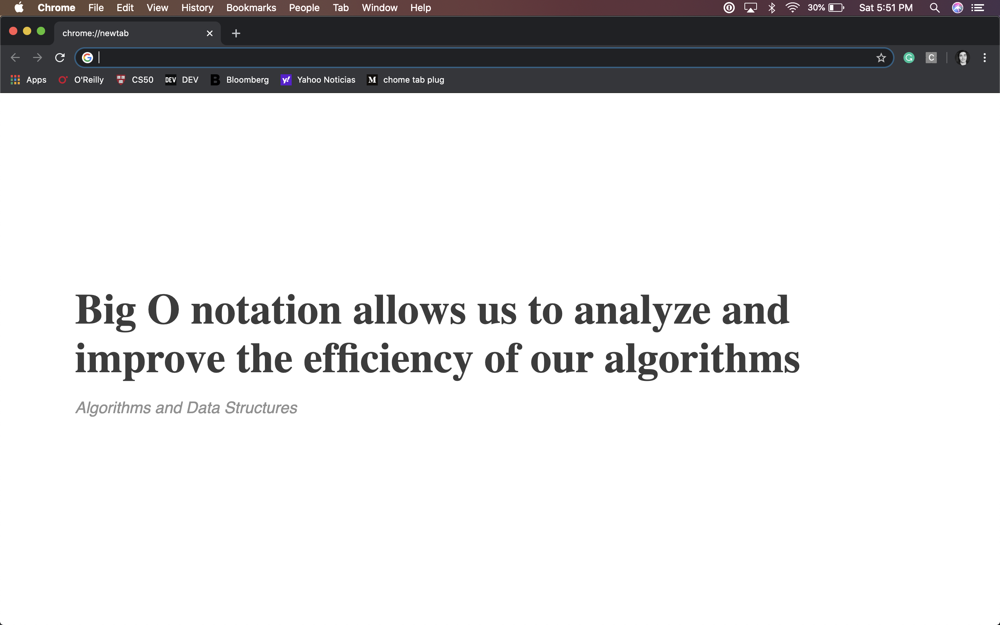

# Coding Advice Chrome Extension

**What is this?** In order to study my tech notes in a dynamic way, I created this chrome extension that shows up a note as coding advice every time that a new tab is opened.

If you are using this chrome extension and want to add new notes, feel free to create an issue or pull request. I'll be happy to receive contributions.

**Screenshot**

